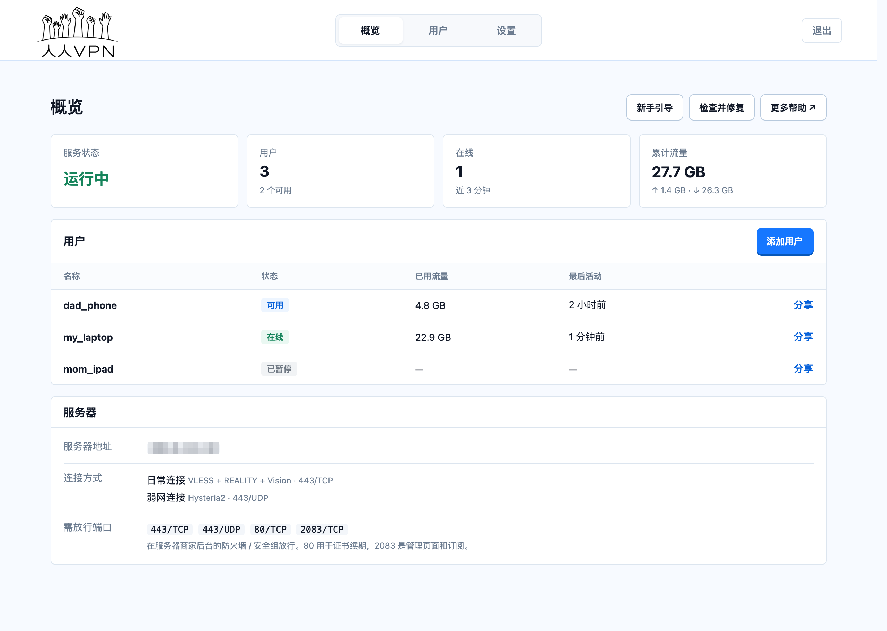
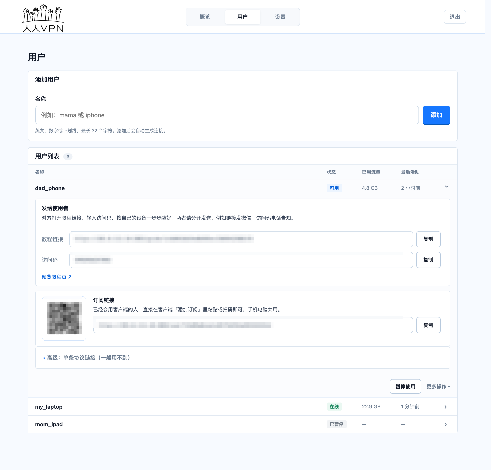
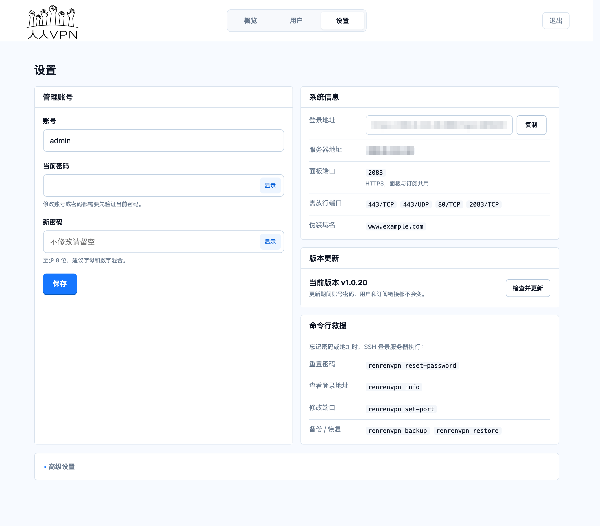
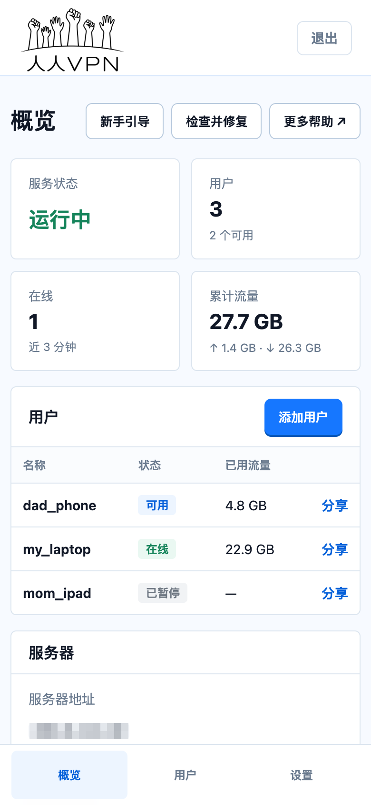

# 人人VPN

**免费、开源的一键自建 VPN 面板。不用敲任何命令，几分钟拥有一台只属于你的 VPN。**

[**一键在线安装**](https://renrenvpn.com/) · [购买服务器教程](https://iwantrun.com/vpn-proxy/17342.html) · [自由档案馆](https://iwantrun.com/)

> **自由访问互联网，是您的权利。** 
> 让更多被困在信息茧房中的人，拥有接触真实世界的可能。

人人VPN 把 VPN 装到**你自己的**海外服务器上，并配好一个全中文的管理页面。
证书、防火墙、协议参数、内核配置全部自动完成；装好以后，在网页上点几下，就能把连接发给家人朋友。

## 项目理念

在一个信息被高墙阻隔、真相被选择性遮蔽的时代，工具本身也可以成为一种微小但具体的抵抗。

所谓的“境外势力”，不应成为人们获取信息的恐惧来源； 
所谓的“盛世繁华”，也不应以封锁知识、限制言论为代价。

## 为什么选择人人VPN

### 简单：不需要任何技术基础

- **不用敲命令**：打开 [renrenvpn.com](https://renrenvpn.com/)，填上服务器的 IP 和密码，剩下的全部自动完成。
- **全中文界面**：首次登录有「新手引导」，一步步带你添加用户、安装客户端、导入连接。
- **分享给家人很轻松**：每个人一条教程链接 + 一个访问码，对方照着页面操作就能用上，不用你远程手把手教。
- **一条订阅链接通用**：同一个链接自动适配不同客户端，扫码即可导入。

### 安全：你的数据只经过你自己的服务器

- **服务器只属于你**：不和陌生人共用，不经过任何第三方，没有「机场跑路」的风险。
- **我们不收集任何信息**：面板没有任何统计、遥测和回传；在线安装时用到的服务器密码，装完立即清除。
- **代码完全开源**：每一行都公开在这里，任何人都可以检查。
- **更新有签名校验**：每次更新都会验证官方签名和文件摘要，被篡改的文件一律拒绝安装。
- **面板是隐身的**：随机端口 + 随机登录地址，别人扫描你的服务器，看到的只是一片空白。
- **正规 HTTPS 证书**：使用 Let's Encrypt 公信证书并自动续期，绝不使用自签证书，也不会让你「忽略证书警告」。

### 稳定：用的是当前最主流的协议

- **默认两种协议**：VLESS + REALITY（日常使用，最难被识别）和 Hysteria2（网络差、丢包严重时依然流畅）。
- **自动开启 BBR 加速**：安装时启用 Linux 内核自带的 BBR 拥塞控制，明显改善「日常连接」的速度和抗丢包能力；服务器内核不支持时自动跳过，不影响安装。
- **一键检查并修复**：连不上时在首页点一下，自动重建配置；伪装域名失效时自动换一个可用的。
- **面板内一键更新**：设置页点「检查并更新」即可，更新失败会自动恢复原来的版本，账号、用户和订阅链接都不变。

### 免费：软件不收一分钱

人人VPN 完全免费。你只需要自己买一台海外服务器，费用直接付给服务器商家。

面板非常轻量，**1 核 CPU、1GB 内存、10GB 硬盘**的入门级服务器就能流畅运行，最便宜的套餐就够用。

### 和其他方式比一比

| | 人人VPN | 机场 | 自己手动搭建 |
| --- | :---: | :---: | :---: |
| 服务器属于谁 | **你自己** | 机场主 | 你自己 |
| 需要懂技术吗 | **不需要** | 不需要 | 需要会 Linux |
| 你的流量经过谁 | **只有你的服务器** | 机场主的服务器 | 只有你的服务器 |
| 跑路、被封号的风险 | **没有** | 有 | 没有 |
| 费用 | **只付服务器钱** | 按月付费 | 只付服务器钱 |
| 给家人朋友用 | **网页上点几下** | 每人各自购买 | 自己逐个配置 |

## 截图

| 概览 | 用户与分享 |
| :---: | :---: |
|  |  |
| **设置** | **手机上的样子** |
|  |  |

*截图使用演示数据，敏感信息已打码。*

## 全部功能

- **用户管理**：添加、暂停 / 恢复、删除用户；可以单独重置某个人的链接，旧链接立刻失效。
- **教程链接 + 访问码**：给每个使用者生成专属教程页，按对方的设备给出下载地址和导入步骤；访问码和链接分开发送，链接被别人看到也打不开。
- **智能订阅**：同一条订阅链接，sing-box / Karing 拿到完整配置，其他客户端拿到通用节点列表，附带二维码。
- **流量统计**：每个用户的累计流量、在线状态和最后活动时间。
- **多种协议**：除默认的两种外，还可以在设置里开启 AnyTLS 和 TUIC，Hysteria2 可选开启混淆。
- **一键检查并修复**、**面板内一键更新**。
- **命令行救援**：忘记密码、忘记地址、面板打不开时，SSH 登录服务器用 `renrenvpn` 命令就能找回。
- **备份与恢复**：一条命令备份全部用户和设置。

## 快速开始

### 1. 准备一台服务器

还没有服务器？照着这篇买：[购买服务器教程](https://iwantrun.com/vpn-proxy/17342.html)。

- 系统推荐 **Ubuntu 22.04** 或 **Debian 12**，必须有**公网 IPv4**。
- 区域优先选择亚洲国家，美国优先选择洛杉矶。
- 配置 1 核 1GB 内存就够用，选最便宜的套餐即可。

### 2. 在线一键安装

打开 **<https://renrenvpn.com/>**，填写服务器的 IP 地址、SSH 端口、用户名和密码，点「开始安装」。
网站会自动连上服务器完成安装，最后把**面板地址、账号和密码**显示给你。全程不需要敲命令。

> 管理密码只显示这一次，请立刻保存好。

### 3. 放行端口，开始使用

1. 在服务器商家后台的防火墙 / 安全组里放行这些端口：
   - `80/TCP`：仅用于申请和续期证书
   - `面板端口/TCP`：安装完成后会告诉你，面板和订阅共用
   - `443/TCP` 和 `443/UDP`：两种默认协议
2. 浏览器打开面板地址登录，跟着「新手引导」添加第一个用户。
3. 把用户的**教程链接**和**访问码**分别发给使用者，对方按页面提示装好客户端即可。

## 客户端推荐

面板里每个平台都有下载按钮和导入步骤，下面是同样的推荐列表（全部免费）：

| 平台 | 推荐客户端 |
| --- | --- |
| iPhone / iPad | [sing-box MT](https://apps.apple.com/us/app/sing-box-mt/id6785326793)、[Karing](https://apps.apple.com/us/app/karing/id6472431552)（中国区 App Store 下载不到，需要使用外区账号） |
| Android | [Karing](https://github.com/KaringX/karing)、[v2rayNG](https://github.com/2dust/v2rayNG) |
| Windows | [sing-box](https://github.com/SagerNet/sing-box)、[v2rayN](https://github.com/2dust/v2rayN) |
| macOS | [sing-box](https://github.com/SagerNet/sing-box)、[v2rayN](https://github.com/2dust/v2rayN) |

> **不推荐 Clash Verge / Clash Meta for Android**：它们只认 Clash 格式的订阅，导入本面板的订阅会显示「零节点」。

## 日常维护

### 面板一键更新

「设置 → 版本更新 → 检查并更新」。更新通常 1 分钟左右，期间面板会暂时打不开，已连接的设备可能断开几秒后自动恢复。
更新失败会自动恢复到原来的版本。

### `renrenvpn` 命令

SSH 登录服务器后可用：

| 命令 | 作用 |
| --- | --- |
| `renrenvpn info` | 显示面板地址、账号和需要放行的端口 |
| `renrenvpn reset-password [新密码]` | 重置管理密码并显示出来（留空则随机生成） |
| `renrenvpn reset-path [路径]` | 换一个随机的面板登录地址 |
| `renrenvpn set-host <IPv4>` | 修改服务器公网 IPv4 |
| `renrenvpn set-port <端口>` | 修改面板端口 |
| `renrenvpn update` | 更新到最新版本 |
| `renrenvpn repair` | 重建 VPN 配置并重启（等同于「检查并修复」） |
| `renrenvpn backup [路径]` | 备份全部用户和设置 |
| `renrenvpn restore <路径>` | 从备份恢复 |

## 常见问题

<b>忘记了面板地址或密码怎么办？</b>

SSH 登录服务器，运行 `renrenvpn info` 查看地址，运行 `renrenvpn reset-password` 重置密码。

<b>面板打不开 / 客户端连不上？</b>

九成是服务器商家后台的防火墙（安全组）没有放行端口。运行 `renrenvpn info` 查看需要放行哪些端口，逐个确认。
端口都放行了还连不上，在面板首页点「检查并修复」。

<b>为什么一定要开放 80 端口？</b>

面板使用 Let's Encrypt 为服务器 IP 签发的正规证书，申请和续期都必须通过 80 端口验证。
80 端口只在验证时使用，平时不提供任何服务。

<b>导入订阅后显示零个节点？</b>

你可能用了 Clash Verge 或 Clash Meta for Android，它们不支持本面板的订阅格式。请换用上面「客户端推荐」里的客户端。

<b>服务器的 IP 被封了怎么办？</b>

在服务器商家后台换一个新 IP，或者换一台服务器，再到 [renrenvpn.com](https://renrenvpn.com/) 重新安装一次。
换 IP 后所有人的连接信息都会变，需要重新发给他们。

<b>支持 IPv6 吗？</b>

目前只支持有公网 IPv4 的服务器。为了防止绕过 VPN 泄露真实地址，sing-box / Karing 拿到的配置会主动拦截 IPv6 流量。

## 隐私与安全细节

- **不收集任何数据**：面板没有统计、遥测或回传，也关闭了访问日志；VPN 内核只记录警告级别的日志，不记录你访问了哪些网站。
- **签名更新**：每个版本都附带一份 Ed25519 签名的清单，记录了安装脚本、面板和内核的 SHA-256。更新时先验签，再逐个核对摘要，任何一项不符都拒绝更新。
- **最小权限**：VPN 内核以独立的低权限用户运行，并启用 systemd 沙箱。
- **数据库权限收紧**：数据库只有面板自己能读写。
- **登录防护**：密码用 bcrypt 加密保存；登录失败太多次会暂时锁定；表单带 CSRF 防护；退出登录会让所有旧会话失效。

## 致谢

由 [自由档案馆](https://iwantrun.com/)（X [@iwantrun_com](https://x.com/iwantrun_com)）开发。

特别感谢 **张狗剩 Archer**（X [@goshenggo](https://x.com/goshenggo)）的支持与帮助。

### 使用的开源项目

人人VPN 站在这些优秀开源项目的肩膀上：

| 项目 | 用途 | 许可证 |
| --- | --- | --- |
| [sing-box](https://github.com/SagerNet/sing-box) | VPN 内核（本项目自行编译，开启了流量统计） | GPL-3.0-or-later |
| [FastAPI](https://github.com/fastapi/fastapi) | 面板的 Web 框架 | MIT |
| [Uvicorn](https://github.com/encode/uvicorn) | Web 服务器 | BSD-3-Clause |
| [Jinja2](https://github.com/pallets/jinja) | 页面模板 | BSD-3-Clause |
| [python-multipart](https://github.com/Kludex/python-multipart) | 表单解析 | Apache-2.0 |
| [python-qrcode](https://github.com/lincolnloop/python-qrcode) | 生成二维码 | BSD |
| [Pillow](https://github.com/python-pillow/Pillow) | 二维码图片输出 | MIT-CMU |
| [bcrypt](https://github.com/pyca/bcrypt) | 密码加密 | Apache-2.0 |
| [itsdangerous](https://github.com/pallets/itsdangerous) | 登录会话签名 | BSD-3-Clause |
| [gRPC Python](https://github.com/grpc/grpc) | 读取流量统计 | Apache-2.0 |
| [SQLite](https://www.sqlite.org/) | 数据库 | Public Domain |
| [acme.sh](https://github.com/acmesh-official/acme.sh) | 申请和续期证书 | GPL-3.0 |
| [Let's Encrypt](https://letsencrypt.org/) | 免费的正规 HTTPS 证书 | 免费服务 |
| [Material Design Icons](https://github.com/google/material-design-icons) | 设备图标 | Apache-2.0 |

设计上参考了这些项目的做法：

| 项目 | 参考了什么 |
| --- | --- |
| [3x-ui](https://github.com/MHSanaei/3x-ui) | 分享链接的格式、用 acme.sh 为 IP 申请证书 |
| [Marzban](https://github.com/Gozargah/Marzban) | 按客户端类型返回不同格式的订阅 |

## 声明

- 人人VPN 是为**个人和家庭使用**设计的，没有配额、到期、计费这类商业运营功能。我们希望它只用于帮助自己和身边的人，而不是拿去售卖。
- 请遵守你所在地以及服务器所在地的法律法规，使用本项目产生的一切后果由使用者自行承担。

## 许可证

本项目以 [GNU General Public License v3.0](LICENSE) 开源。你可以自由使用、修改和分发，但分发修改后的版本时必须同样以 GPL-3.0 公开源代码。
